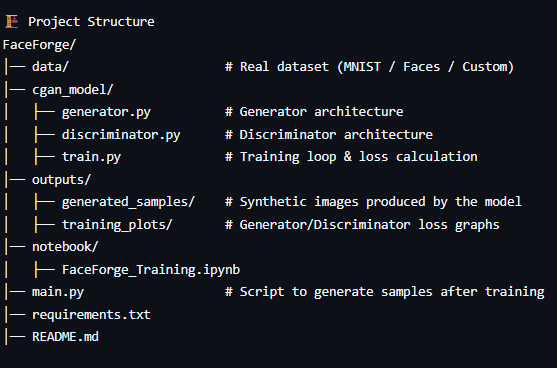
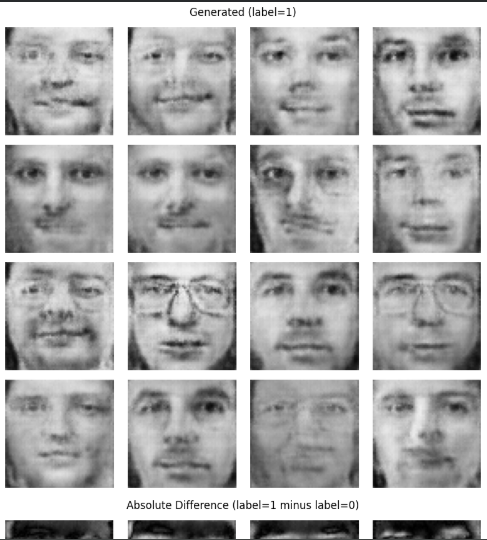
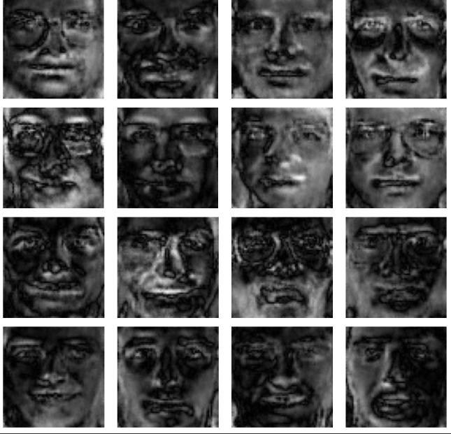

🧬 FaceForge – Synthetic Data Generation using Conditional GANs (cGAN)
FaceForge is an AI-powered synthetic data generation system built using Conditional Generative Adversarial Networks (cGANs).
It generates high-quality, class-conditioned synthetic images that help solve problems like data scarcity, class imbalance, and privacy restrictions in ML workflows.

🚨 Problem Statement

Modern machine learning systems require large, diverse, balanced datasets.
However:
Many domains have limited or imbalanced datasets
Real data often contains private or sensitive information
Training on small datasets leads to overfitting and poor accuracy
FaceForge solves this using synthetic data, allowing ML models to train on rich, balanced, privacy-safe datasets.

🎯 Key Features

✔ Class-conditioned synthetic image generation
✔ Fully trainable cGAN architecture
✔ High-quality samples resembling real distributions
✔ Balanced data creation for minority classes
✔ Privacy-preserving dataset generation
✔ Latent space exploration & noise-based variations
✔ Training visualizations (loss curves & sample grids)
✔ Exportable synthetic datasets for ML pipelines

🧠 Tech Stack
Python
TensorFlow / Keras (or PyTorch)
NumPy, Matplotlib, Seaborn
Google Colab
Generative AI (cGAN architecture)

🏗️ Project Structure

🔍 How It Works
1️⃣ Dataset Input

FaceForge accepts any labeled dataset (e.g., MNIST, face datasets, custom images).

2️⃣ Conditional GAN Architecture
Generator (G): Creates fake images conditioned on labels
Discriminator (D): Determines real vs fake + label correctness
Both networks train adversarially until G produces realistic images

3️⃣ Training Loop Overview
Train D on real + fake images
Train G to fool D
Repeat for thousands of epochs
Save models and generated samples

4️⃣ Output Delivered
Synthetic dataset
Sample grids
Trained model weights
Loss graphs

⚙️ How to Run
📌 Google Colab (Recommended)
Open FaceForge_Training.ipynb in Google Colab
Upload your dataset
Run all cells
Synthetic images appear in:
outputs/generated_samples/

📌 Local System
Install dependencies:
pip install -r requirements.txt
Train the model
python train.py
Generate new synthetic images:

from cgan_model.generator import Generator
gen = Generator()
gen.generate(label=5, num_images=20)

📊 Sample Results

🧪 Use Cases
🔹 1. ML Training Without Real Data
Useful in healthcare, banking, HR, and surveillance.
🔹 2. Fixing Imbalanced Datasets
Generate more samples for rare classes.
🔹 3. Privacy-Preserving Analytics
Synthetic data → no personal identity exposure.
🔹 4. Research on GANs / Generative AI
Perfect for academic, hackathon, and research projects.

🚀 Future Enhancements
Add Diffusion-GAN hybrid for higher resolution
Deploy as an API for on-demand synthetic data
Add attribute-based face generation
Integrate a Streamlit UI

🏆 Hackathon Value Proposition
FaceForge is strong for hackathons because it solves:
✔ Real-world data scarcity
✔ Ethical & privacy problems
✔ ML fairness
✔ Dataset imbalance

Plus, it showcases strong knowledge of:
Deep learning
GAN training
Generative modeling
Synthetic data ethics

👤 Team menbers:-
Sure Bhavya Varshitha ,
Cherukuri Asha Sri Valli
